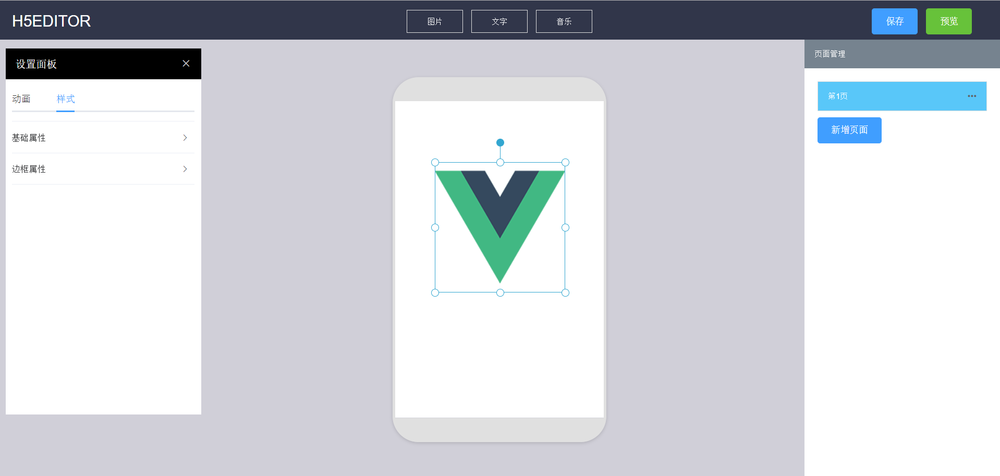
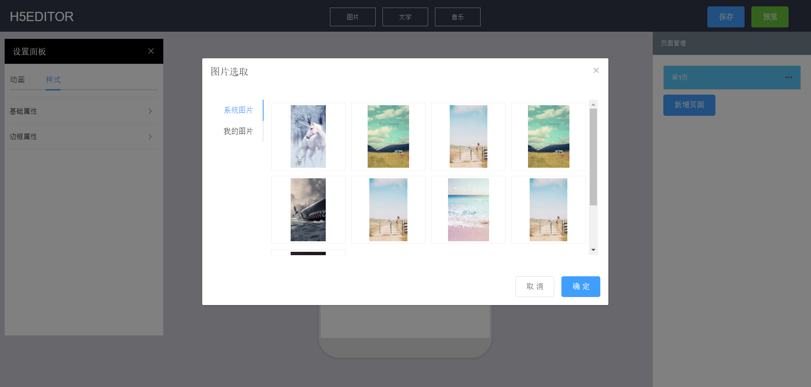
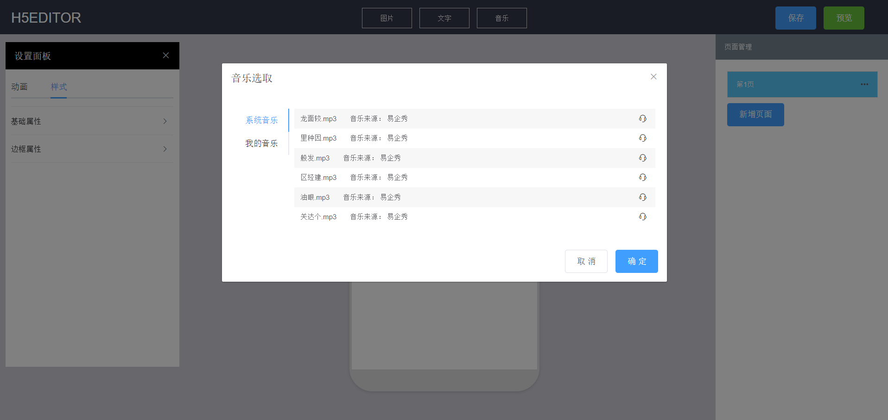

# h5editor

## 简介

h5editor是一款可视化手机h5编辑器（微场景，主要上下全屏翻页，叫h5编辑器不是很准确，不过周围人都以为这样子的效果是h5的话，那它就是h5吧），它基于vue2、element-ui实现，主要功能模仿易企秀，目前实现的效果比较简单。

在线预览地址：[h5editor](https://alvin-liu.github.io/h5editor/dist/ "DEMO")

## 效果截图

## 主要功能

### 已实现功能

- 添加文字、图片组件
- 拖动、拉伸、旋转组件
- 修改样式
- 添加动画
- 增、删、改页面
- 添加音乐
- 保存到localStorage
- 预览效果

### 预计近期要实现的功能

- yapi
- 右键菜单
- 组件的删除、z-index层级设置
- copy组件
- copy页面
- 背景修改
- 点击跳转
- 网格

### 将来可能添加的功能

- 其他更多组件
- 触发点击、摇一摇事件
- 二维码手机预览
- 模板列表
- 上一步下一步
- 键盘操作
- nodejs操作数据库存储
- 更多可期待...

## 项目使用方法

1.克隆或者下载本项目：

    $ git clone https://github.com/Alvin-Liu/h5editor.git

2.安装模块依赖：

    npm install

3.启动服务：

    npm run dev

4.打包代码：

    npm run build

## 疑问解答（寻求更好的解决方案）

即是代码设计的解答，也是更好方案的寻找，写下来发现并不够优雅，坐等大佬!!!

### 实现原理？

依赖vue，维护一个大的json，以数据驱动（改变json）的方式对组件进行增删改查

### json奇怪？

当功能越来越丰富，属性越来越多，配置越来越大的时候，维护的json可能会越来越大，对更新和维护可能未知的风险

### 样式？

使用的是element-ui和网易的nec，大概是一个很烂的搭配，也大概是我不会写样式，nec的命名写着写着真的可能看不懂...

   

